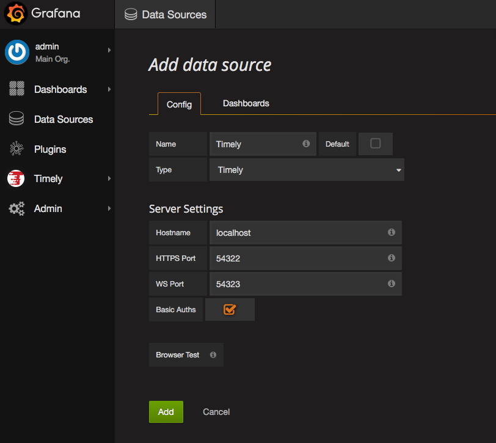
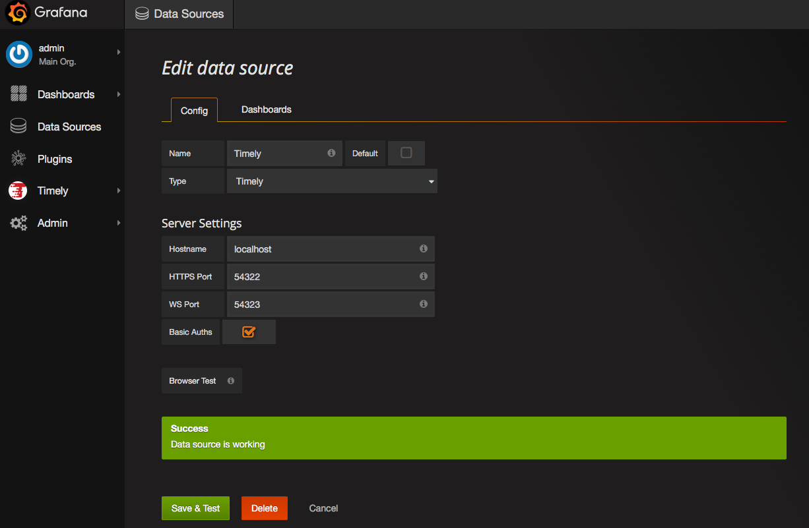
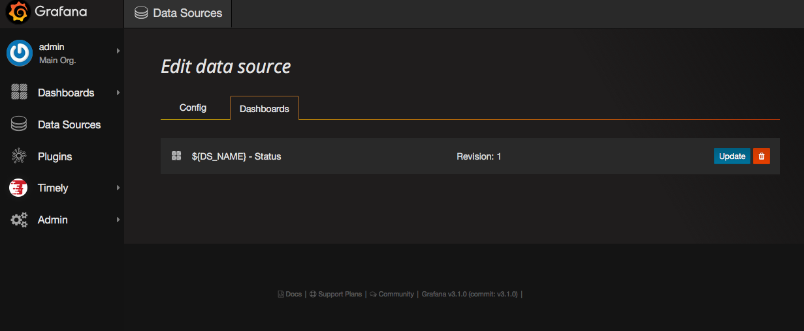
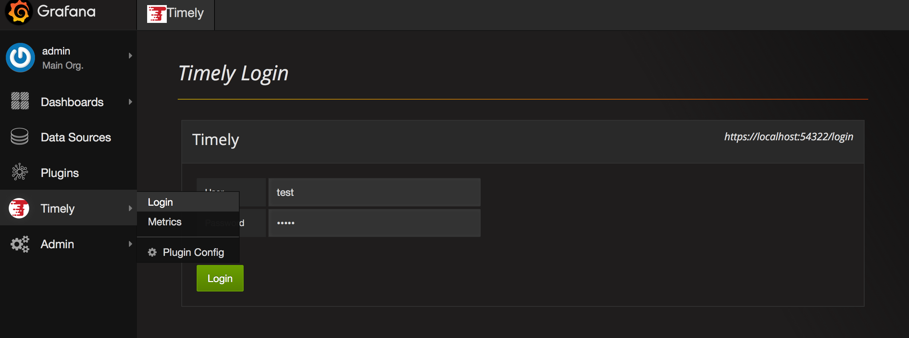
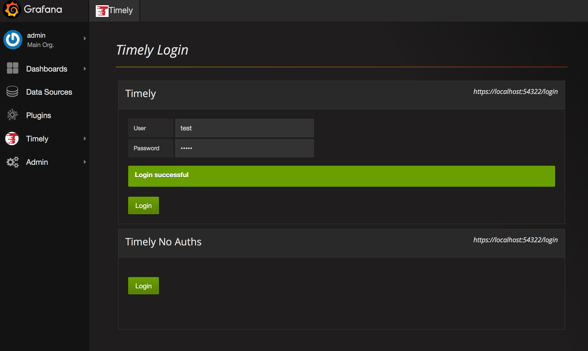
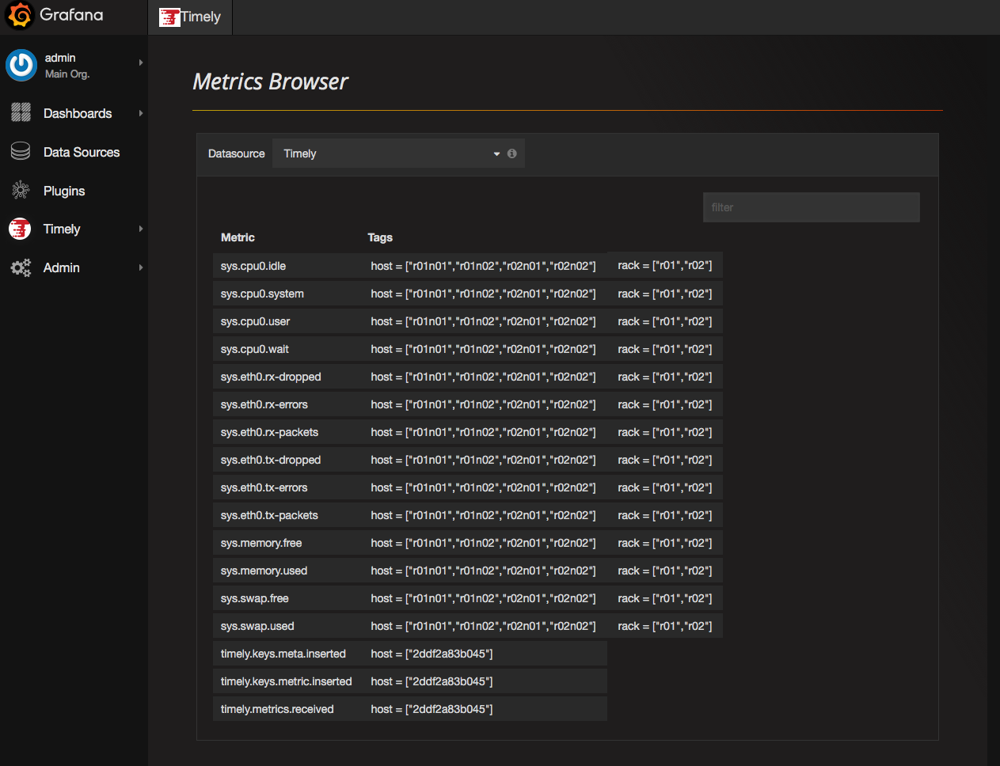
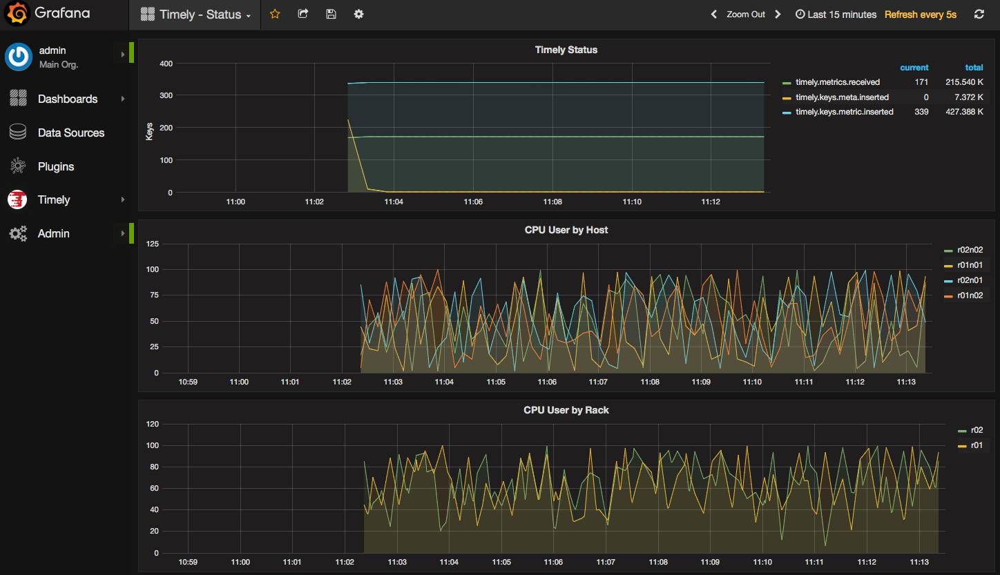

# Timely-App

This is an app plugin for the [Grafana](http://grafana.org) time-series visualization tool.

## Installation

Unpack the contents of the timely-app directory into the grafana plugins directory.

By default, `/var/lib/grafana/plugins/`  

Restart Grafana.

Login to Grafana and the Home dashboard should show the Timely App is available.

## Enable Timely App

Once installed, the Timely App must be enabled in Grafana. Clicking the Enable Now
link on the Home Dashboard or navigate to the app list in the Grafana Plugins page.

These will both bring you to the enable page.

Once enabled, Timely should appear in Grafana menu.

## Create Datasource

Go to the Grafana Data Sources menu and add a new Data Source. In the Type drop down menu, select Timely and the Timely Server settings UI will populate.

Fill in the timely server details as required. The Browser Test opens a new browser window to allow you to add an exception to the Timely server cert. This is only necessary if using self-signed certs.

Click Add, and the datasource will be tested and added.

Clicking the Dashboards tab will allow you to import a dashboard to display Timely's internal metrics. Depending on the security setup, the dashboard may not show any data until the Login process is completed.

## Login

From the Timely App menu, select the Login page. This will present you a login prompt to authenticate you with the Timely datasources. This will set a cookie in your Browser
that will be passed with the dashboard queries and Timely will pass your Accumulo column visibilities during data scans.

View dashboard - this should now be working

If more than one Timely datasource is defined, multiple Login prompts will be available. Here, the top data source was defined with BasicAuths checked, and the second one assumes a valid Certificate is loaded in the browser and will be passed to Timely when Login is clicked.

## Metrics Browser

To help browsing the data in Timely, the Timely menu also contains a Metrics link to take you to the Metrics Broswer

Timely data sources can be selected from the drop down menu and the results can be filtered by typing in the filter box.

## Dashboard

Currently the imported dashboard has one plot for timely ingest metrics, and three other plots to display the artificial data inserted by the `timely.util.InsertTestData` program.

