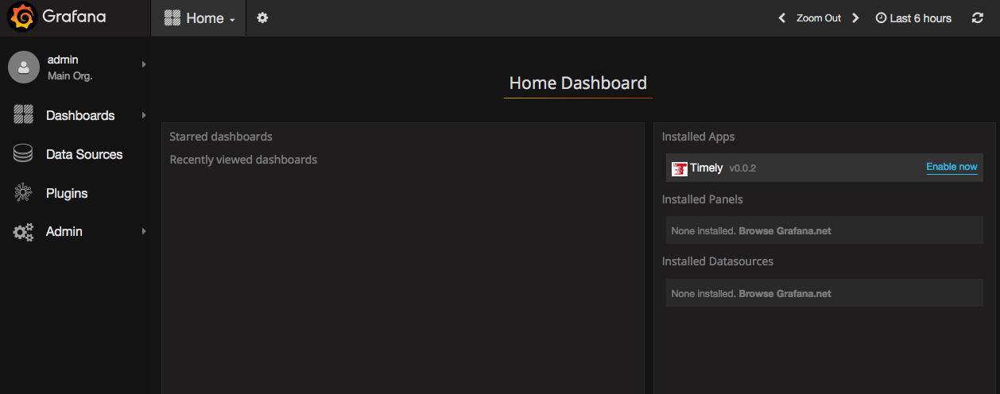
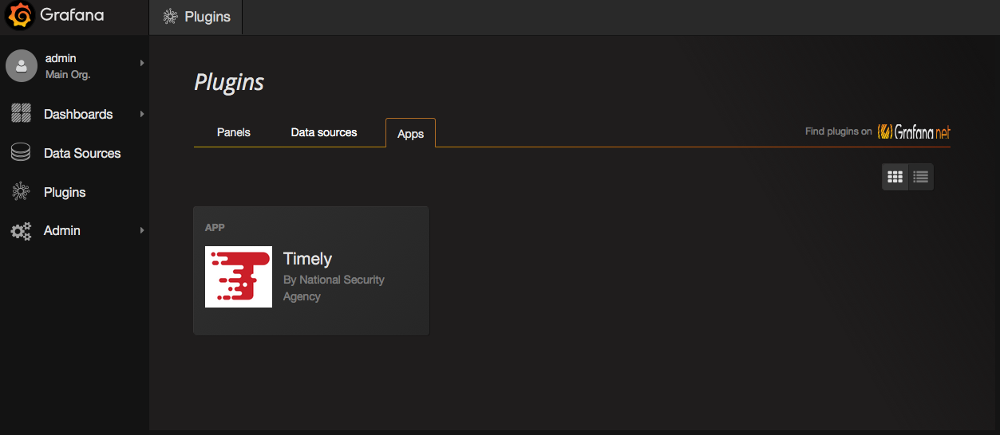
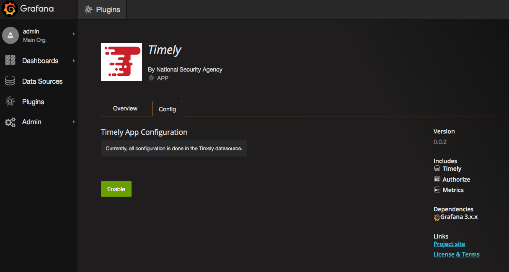
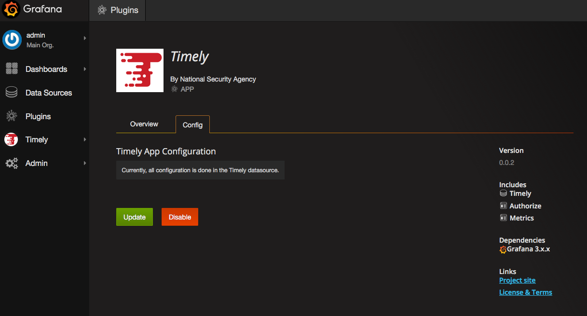

# Timely-App

This is an app plugin for the [Grafana](http://grafana.org) time-series visualization tool.

## Installation

Unpack the contents of the timely-app directory into the grafana plugins directory.

By default, `/var/lib/grafana/plugins/`  

Restart Grafana.

Login to Grafana and the Home dashboard should show the Timely App is available.

## Enable Timely App

The timely app must first be enabled in Grafana. Clicking the Enable Now link or navigate to the app list
in Grafana

will bring you to the enable page.

Once enabled, Timely should appear in Grafana plugins menu.

## Create Datasource

Browser Test - opens separate browser window to allow you to accept the cert manually if you don't have cert and ca installed in browser.

Click Add. This test connection to Timely using the /version rest endpoint.

Import dashboard. Currently displays fake ingest data and real timely ingest metrics. Dashboard should be visible in Timely-Status

Get user authorizations from Timely. At this point dashboard may not work if anonymous access is disabled in Timely. Must login to Timely
to set session cookie so Timely can query data using your authorizations.

View dashboard - this should now be working
